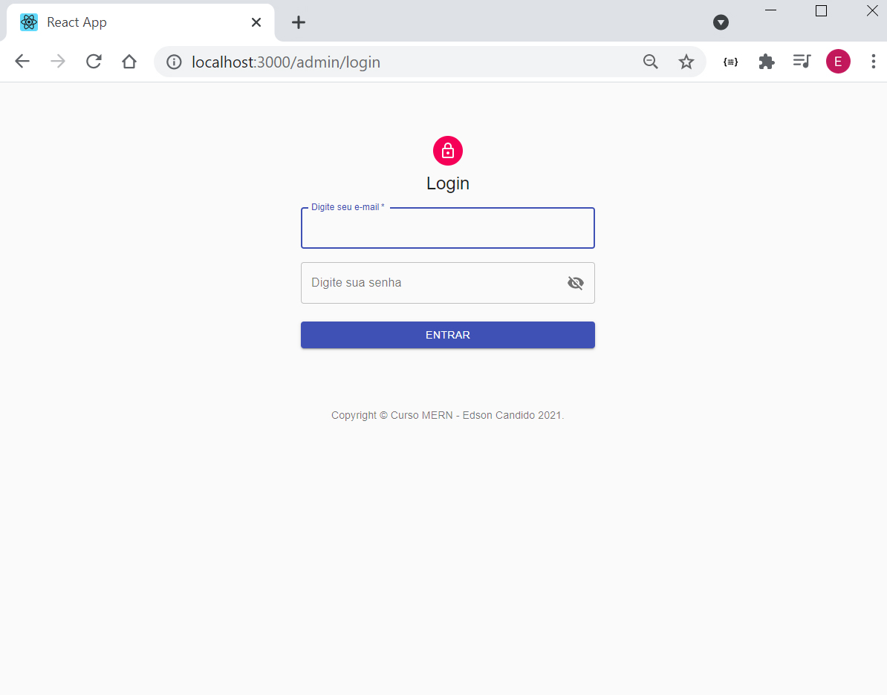
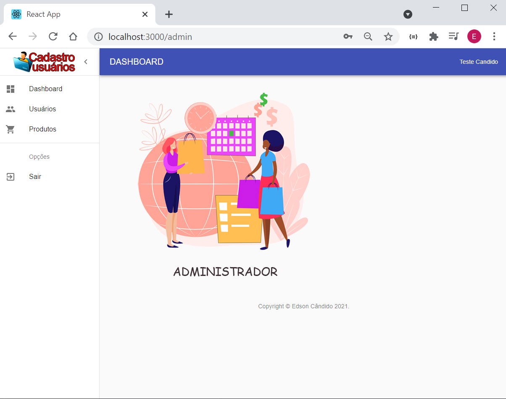
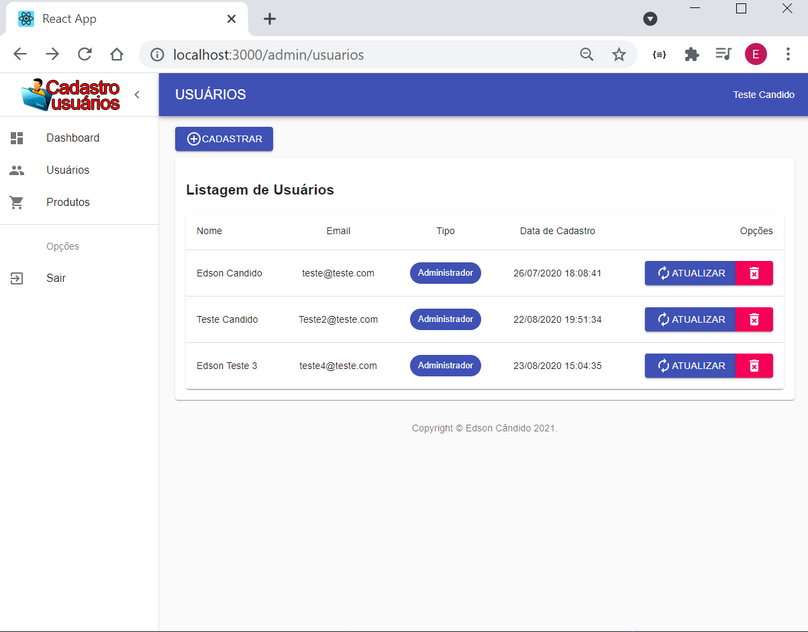
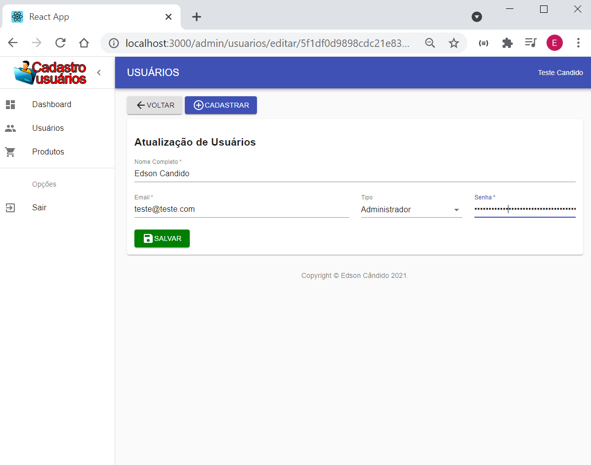

<h2 align="center"> 
	Cadastro usuários e produtos 1.0 
</h2>

  

  

  
  
  

## 💻 Sobre o projeto

CRUD de usuários e produtos focado no aprendizado MERN Stack.

## 🛠 Tecnologias

As seguintes tecnologias foram usadas na construção do projeto:
- [MongoDB][mongo]
- [Express][express]
- [React][reactjs]
- [Node.js][nodejs]
- [JavaScript][javascript]
- [JWT][jwt]
- [Material-UI][material]

   
   

   
   

## 📝 Licença

Este projeto esta sobe a licença MIT. 

Feito por Edson Cândido - Curso Básico MERN desenvolvido por Daniel Correia

[nodejs]: https://nodejs.org/
[reactjs]: https://reactjs.org
[mongo]: https://www.mongodb.com/
[express]: https://expressjs.com/pt-br/
[javascript]: https://developer.mozilla.org/pt-BR/docs/Learn/JavaScript
[jwt]: https://jwt.io/
[material]: https://material-ui.com/

